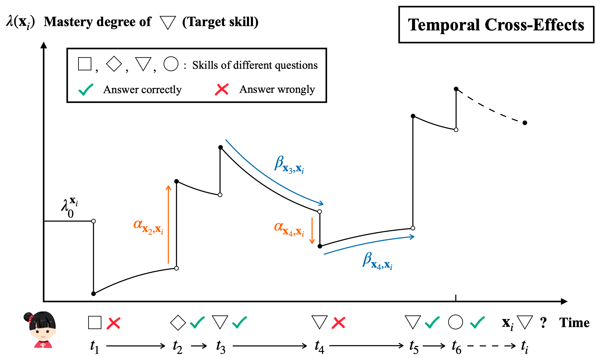

# HawkesKT



This is our implementation for the paper:

*Chenyang Wang, Weizhi Ma, Min Zhang, Chuancheng Lv, Fengyuan Wan, Taoran Tang, Huijie Lin, Yiqun Liu, and Shaoping Ma. [Temporal Cross-effects in Knowledge Tracing.]() 
In WSDM'21.

**Please cite our paper if you use our codes. Thanks!**


## Usage		

1. Install [Anaconda](https://docs.conda.io/en/latest/miniconda.html) with Python >= 3.5
2. Clone the repository and install requirements

```bash
git clone https://github.com/THUwangcy/HawkesKT
cd HawkesKT
pip install -r requirements.txt
```

3. Prepare datasets according to [README](https://github.com/THUwangcy/HawkesKT/tree/main/data/README.md) in data directory
4. Run model, e.g.

```bash
cd src
python main.py --model_name HawkesKT --emb_size 64 --max_step 50 --lr 5e-3 --l2 1e-5 --time_log 5 --gpu 1 --dataset ASSISTments_09-10
```


Example training log in ASSISTments_12-13 dataset can be found [here](https://github.com/THUwangcy/HawkesKT/blob/main/log/HawkesKT/HawkesKT__ASSISTments_12-13__2019__lr%3D0.001__l2%3D0.0__fold%3D0__time_log%3D5.0.txt) in log directory.

